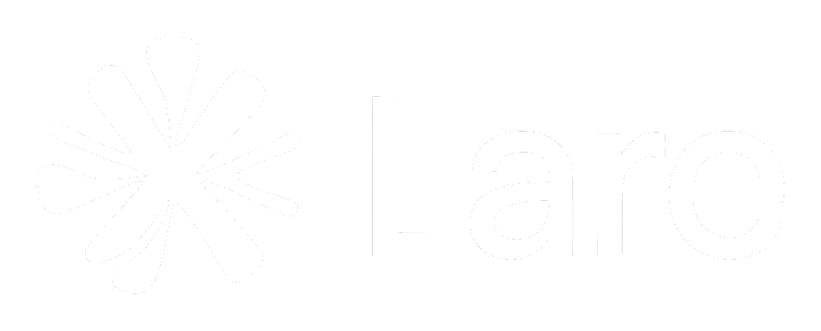

<div align="center">



**Hevy for LeetCode.**
Your practice logs itself — every problem opened, every submission judged, with code,
runtime and memory percentiles and the runtime distribution graph.

[](https://github.com/chaubenn/lare/actions/workflows/ci.yml)
[](https://github.com/chaubenn/lare/releases/latest)
[](https://github.com/chaubenn/lare/releases)
[](LICENSE)


[Install](#install) · [Architecture](docs/architecture.md) · [Releasing](docs/releasing.md) · [QA](docs/qa.md) · [Privacy](docs/privacy.md)

</div>

---

Share posts with followers, attach demo videos, and run AI-graded mock interviews.

| | |
| --- | --- |
| **Chrome extension** | Captures problems, your Monaco edits and judge results on its own — nothing to start or stop. Records mock interviews from a side panel. |
| **Desktop app** (Tauri) | Records your screen natively with Cap's recording stack and **transcribes interviews locally with whisper.cpp**. |
| **Web** | The same app: feed, posts, profiles, drafts, sessions — plus recording in the browser. |

**You can do everything on the web except be graded.** A mock interview is *graded* when the
desktop app is running: the extension streams your microphone to it over loopback, whisper.cpp
transcribes it on your machine while you talk, and the AI review is built from that transcript.
Without the app, an interview is *ungraded* — video only, no transcript, no AI — and the extension
says so before you start rather than degrading quietly. Local transcription is the reason the
desktop app exists; it is not going to the cloud.

Video uploads while it records, not after you stop, so stopping is roughly instant no matter how
long you recorded.

## Install

Two pieces: the desktop app and the Chrome extension. About two minutes.

### 1. Desktop app

| Platform | Download |
| --- | --- |
| macOS (Apple Silicon, M1 and later) | [Lare-macOS-AppleSilicon.dmg](https://github.com/chaubenn/lare/releases/latest/download/Lare-macOS-AppleSilicon.dmg) |
| macOS (Intel) | [Lare-macOS-Intel.dmg](https://github.com/chaubenn/lare/releases/latest/download/Lare-macOS-Intel.dmg) |
| Windows 10/11 (x64) | [Lare-Windows-x64-Setup.exe](https://github.com/chaubenn/lare/releases/latest/download/Lare-Windows-x64-Setup.exe) |

All versions: [Releases](https://github.com/chaubenn/lare/releases).

- **macOS**: open the DMG, drag Lare to Applications. The build is not notarised yet, so the
  first launch needs right-click > **Open** (or `xattr -dr com.apple.quarantine /Applications/Lare.app`).
  Grant Screen Recording / Camera / Microphone when asked (needed for demo videos and interviews).
- **Windows**: run the installer. If SmartScreen appears, click **More info** > **Run anyway**.

Lare checks GitHub Releases on every launch and installs updates in the background; you can also
run **Settings > Check for updates**.

### 2. Chrome extension

1. Download [Lare-Chrome-Extension.zip](https://github.com/chaubenn/lare/releases/latest/download/Lare-Chrome-Extension.zip) and unzip it.
2. Open `chrome://extensions`, turn on **Developer mode** (top right).
3. Click **Load unpacked** and pick the unzipped folder.
4. Pin the Lare icon and click it to open the side panel, then sign in and open any LeetCode
   problem. Practice starts logging itself immediately.

The extension works on its own — sign-in, passive capture, drafts and ungraded interviews need
nothing else running. It talks to the desktop app over `127.0.0.1` only to hand it interview
audio for local transcription, so the app has to be open for a *graded* interview and the
desktop footer shows **Extension: connected**. Chrome 116+. Chrome Web Store listing is coming;
until then the unpacked install is the supported path.

## Development

```bash
pnpm install
pnpm dev:web          # Next.js
pnpm dev:extension    # wxt, then load apps/extension/.output as unpacked
pnpm dev:desktop      # Tauri
```

To try this checkout like an installed build, build both into `out/`:

```bash
pnpm bundle           # out/Lare.app (macOS) or out/Lare/Lare.exe (Windows), plus out/extension
pnpm bundle --open    # ...and launch the app
pnpm bundle ext       # just the extension; `app` for just the app, --release for an optimised build
```

Load `out/extension` at `chrome://extensions` (Developer mode → Load unpacked).

```bash
pnpm lint             # biome
pnpm typecheck
pnpm test
```

Rust needs prebuilt ffmpeg — `pnpm setup:native` writes the cargo env for your target.

Branching, CI lanes and how to cut a release: **[docs/releasing.md](docs/releasing.md)**.

## License

AGPL-3.0-only. Portions derived from Cap (AGPL-3.0 / MIT); see [`NOTICE`](NOTICE).
