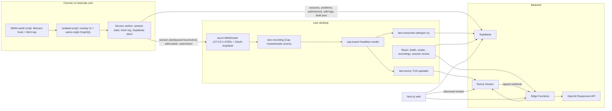

# Lare architecture

Hevy for LeetCode: log practice sessions with a pausable timer, capture submissions (code, runtime
and memory percentiles, the runtime distribution graph), share posts with followers, attach demo
videos, and run AI-graded mock interviews.

## Parts

| Part | Stack | Responsibility |
| --- | --- | --- |
| `apps/extension` | Chrome MV3, WXT, React | Session timer (pausable), problem capture, Monaco edit log, judge result capture, mock-interview trigger. Writes to Supabase directly; talks to the desktop over `ws://127.0.0.1:47831`. |
| `apps/desktop` | Tauri 2, React 19, Rust | Drafts and publishing, screen/camera/mic recording (recycled from Cap), whisper.cpp transcription, Bunny TUS uploads, studio editor, interview review. |
| `apps/web` | Next.js 15, Vercel | Public post pages `/p/[id]`, profiles `/u/[handle]`, follower feed, follow requests. |
| `supabase/` | Postgres + RLS, Auth, Storage, Realtime, Edge Functions (Deno) | Source of truth for users, sessions, posts, videos; Bunny signing; OpenAI review. |
| Bunny Stream | library `lare` (id 743884) | Video storage, encoding, delivery. Embed token authentication is on. |

## Data model (Supabase)

- `profiles` (handle, display_name, avatar_url, bio, `is_private`), `follows` (pending/accepted).
- `sessions` (kind practice|interview, scope session|problem, status, `started_at`, `ended_at`,
  `active_ms`, `recording_id`, `recording_started_at`), `session_events` (start/pause/resume/end/
  problem_open/problem_close, wall-clock `t`) - the timer is derived from the event log.
- `session_problems` (slug, title, difficulty, description_html, `edits_path` -> gzip JSON edit log
  in Storage bucket `session-data`), `submissions` (code, verdict, runtime/memory + percentiles,
  distributions).
- `videos` (Bunny guid, status created|uploading|uploaded|processing|ready|failed, dimensions,
  `thumbnail_path` in bucket `thumbnails`), `posts` (draft|published, visibility public|private,
  `video_id`, `video_kind` none|full|highlights, `include_ai_insights`).
- `transcripts` (segments `[{s,e,text}]` in media ms), `interview_reviews` (OpenAI structured output).
- Visibility: `can_view_post` - published and (owner, or public post and (author not private or
  accepted follower)). Child rows inherit through their post; AI insights additionally require
  `include_ai_insights`.

Edge Function configuration lives in Supabase Vault (`public.get_app_secrets`, service role only)
with `Deno.env` taking precedence; see `supabase/functions/_shared/http.ts`.

## Time model

Everything on a session is placed on one **media clock**: milliseconds since
`sessions.recording_started_at` (falling back to `started_at`) **minus the paused stretches**
recorded in `session_events`. The recording skips pauses, so transcript segments and AI moments are
already in media time; edit events (wall-clock epoch from Monaco) and submissions are converted with
`toMediaMs` (`packages/shared/src/timer.ts`, mirrored in `supabase/functions/_shared/edits.ts`).

## Recording pipeline

1. Extension `session.start` (kind interview) or the draft editor's *Record* button.
2. `Recorder` (`apps/desktop/src-tauri/src/recorder.rs`) starts Cap's **instant** actor (single
   MP4; facecam preview window is captured as part of the screen) or **studio** actor (display,
   camera and mic tracks per pause/resume clip). Overlay windows: recorder pill and camera preview.
3. On stop, studio projects are remuxed (`RecoveryManager::remux_if_needed`) so every clip has a
   `display.mp4`; the `recording:completed` event hands the recording to the React pipeline.
4. `features/recording/pipeline.ts`:
   - instant demo -> `publishVideo` (create Bunny video via `bunny-create-upload`, thumbnail to
     Storage, TUS upload from Rust with progress events, attach to the draft);
   - interview -> render (`cap-export`, facecam PiP if recorded) -> transcribe the render with
     whisper -> upload -> captions (`bunny-captions`) -> attach to the session's draft;
   - studio -> editor (`/studio/:recordingId`) -> `exportAndPublish` with the user's edit.
5. Bunny calls `bunny-webhook` (HMAC) as it encodes; `videos.status` flips to `ready` and the web
   and desktop players pick it up over Realtime. Playback URLs come from `bunny-playback-token`
   after an RLS visibility check.

Bookkeeping for resumable pipelines is in the Tauri store (`recordings.json`), surfaced on the
Recordings page.

## Licensing

`crates/cap/*` is vendored from [Cap](https://github.com/CapSoftware/Cap) (AGPL-3.0, with the
`cap-camera*`/`scap-*` crates under MIT); Lare is therefore AGPL-3.0-only. See `NOTICE`.
