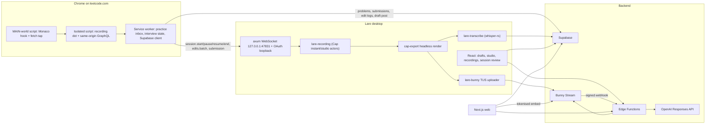

# Lare architecture

Hevy for LeetCode: log practice sessions with a pausable timer, capture submissions (code, runtime
and memory percentiles, the runtime distribution graph), share posts with followers, attach demo
videos, and run AI-graded mock interviews.

## Parts

| Part | Stack | Responsibility |
| --- | --- | --- |
| `apps/extension` | Chrome MV3, WXT, React | Passive practice capture (every problem opened, every submission judged — nothing to start or stop), Monaco edit log, mock-interview trigger. On-page UI is one recording dot, shown only while an interview records; the popup is the control surface. Writes to Supabase directly; talks to the desktop over `ws://127.0.0.1:47831`. |
| `apps/desktop` | Tauri 2, React 19, Rust | Drafts and publishing, screen/camera/mic recording (recycled from Cap), whisper.cpp transcription, Bunny TUS uploads, studio editor, interview review. |
| `apps/web` | Next.js 16, Vercel (`syd1`) | Public post pages `/p/[id]`, profiles `/u/[handle]`, follower feed, follow requests. |
| `supabase/` | Postgres + RLS, Auth, Storage, Realtime, Edge Functions (Deno) | Source of truth for users, sessions, posts, videos; Bunny signing; OpenAI review. |
| Bunny Stream | library `lare` (id 743884) | Video storage, encoding, delivery. Embed token authentication is on. |

## Data model (Supabase)

- `profiles` (handle, display_name, avatar_url, bio, `is_private`), `follows` (pending/accepted).
- `sessions` (kind practice|interview, scope session|problem, status, `started_at`, `ended_at`,
  `active_ms`, `recording_id`, `recording_started_at`), `session_events` (start/pause/resume/end/
  problem_open/problem_close, wall-clock `t`) - the timer is derived from the event log.
- `session_problems` (slug, title, difficulty, description_html, `edits_path` -> gzip JSON edit log
  in Storage bucket `session-data`), `submissions` (code, verdict, runtime/memory + percentiles,
  distributions).
- `videos` (Bunny guid, status created|uploading|uploaded|processing|ready|failed, dimensions,
  `thumbnail_path` in bucket `thumbnails`), `posts` (draft|published, visibility public|private,
  two video slots — `video_id` + `video_kind` none|full|highlights for the demo/full take and
  `demo_video_id` for an interview's summary clip, each with a `show_*` switch — plus the three
  optional extras the draft editor groups together: `include_ai_insights`, `include_og_card`,
  `og_show_ai_scores`).
- `post_media` (carousel photos plus the one `kind = 'og'` row holding the pre-generated session
  card written by `og-snapshot`), `post_likes`, `post_comments`.
- `transcripts` (segments `[{s,e,text}]` in media ms), `interview_reviews` (OpenAI structured output).
- Visibility: `can_view_post` - published and (owner, or public post and (author not private or
  accepted follower)). Child rows inherit through their post; AI insights additionally require
  `include_ai_insights`.

Edge Function configuration lives in Supabase Vault (`public.get_app_secrets`, service role only)
with `Deno.env` taking precedence; see `supabase/functions/_shared/http.ts`.

## Web deployment

Vercel functions are pinned to **`syd1`** (`apps/web/vercel.json`), because the Supabase project
lives in `ap-southeast-2`. On Vercel's default region (`iad1`) every Supabase call from a Server
Component crossed the Pacific, and a signed-in page makes several in sequence — session, feed,
then signing and likes and comments — so ~200 ms of latency was paid three times over before
anything rendered. Colocating with the database is the right trade even for viewers far from
Sydney: they pay one slow hop to the function instead of one per query.

Every route reads cookies, so every route is dynamic and nothing is cached at the edge; what makes
navigation feel instant instead is `loading.tsx` on the main routes plus
`experimental.staleTimes` in `next.config.ts`, which lets the client router reuse a page it just
rendered. `createClient` is memoised with React `cache`, so one request builds one Supabase client
and verifies the JWT once.

## Time model

Everything on a session is placed on one **media clock**: milliseconds since
`sessions.recording_started_at` (falling back to `started_at`) **minus the paused stretches**
recorded in `session_events`. The recording skips pauses, so transcript segments and AI moments are
already in media time; edit events (wall-clock epoch from Monaco) and submissions are converted with
`toMediaMs` (`packages/shared/src/timer.ts`, mirrored in `supabase/functions/_shared/edits.ts`).

## Recording pipeline

1. Extension `session.start` (kind interview) or the draft editor's *Record* button.
2. `Recorder` (`apps/desktop/src-tauri/src/recorder.rs`) starts Cap's **instant** actor (single
   MP4; facecam preview window is captured as part of the screen) or **studio** actor (display,
   camera and mic tracks per pause/resume clip). Overlay windows: recorder pill and camera preview.
   Both are built once and thereafter only shown and hidden — the pill's stop button lives inside
   its own webview, and destroying that webview under an in-flight `recording_stop` aborts the
   process. `destroy_overlays` closes them when the main window goes, which is also what quits the
   app now that the overlays outlive every recording.
3. On stop, studio projects are remuxed (`RecoveryManager::remux_if_needed`) so every clip has a
   `display.mp4`; the `recording:completed` event hands the recording to the React pipeline.
   `stop` and `cancel` are serialised on one mutex and idempotent — the pill's stop button and the
   extension's `session.end` race on every interview ended from the browser, and the second caller
   gets the first one's payload rather than an error. The completed manifest
   (`lare-recording.json`) is written before anything else can fail; if Cap's own stop errors,
   `lare_recording::finalize_project` finishes the take from the fragments on disk instead. The
   same call recovers projects a killed process abandoned (a `lare-started.json` with no completed
   manifest) at the next launch, so they simply turn up in Recordings.
4. `features/recording/pipeline.ts`:
   - instant demo -> `publishVideo` (create Bunny video via `bunny-create-upload`, thumbnail to
     Storage, TUS upload from Rust with progress events, attach to the draft);
   - interview -> render (`cap-export`, facecam PiP if one was recorded) -> transcribe the render
     with whisper -> upload -> captions (`bunny-captions`) -> attach to the session's draft. The
     facecam is optional and so is the render: if it fails, the transcript is still taken from the
     raw mic track and saved before the failure is reported, so the AI review is never lost with
     the video;
   - studio -> editor (`/studio/:recordingId`) -> `exportAndPublish` with the user's edit.
5. Bunny calls `bunny-webhook` (HMAC) as it encodes; `videos.status` flips to `ready` and the web
   and desktop players pick it up over Realtime. Playback URLs come from `bunny-playback-token`
   after an RLS visibility check.

The recorder reports `recordedMs` — wall clock less every paused stretch — with each state and
completed payload, so the pill's timer counts the video rather than the sitting.

Bookkeeping for resumable pipelines is in the Tauri store (`recordings.json`), surfaced on the
Recordings page. It also records which of the post's two video slots a take was started for — the
recorder manifest only carries the post id.

## Post carousel

One deck, rendered identically by `apps/web/components/post-slides.tsx` and
`apps/desktop/src/features/feed/PostSlides.tsx`:

    session card (or the author's cover) -> session breakdown -> summary video -> photos -> demo/full video

The session card is `/api/og/{id}`: the Open Graph image *and* the first slide, so the two cannot
drift. `og-snapshot` renders that route with the author's JWT and stores the PNG, so shared links
and the feed read one image instead of rendering per request. Both are opt-out per post
(`include_og_card`), and an interview may also draw its AI review percentages on the card
(`og_show_ai_scores`).

## Licensing

`crates/cap/*` is vendored from [Cap](https://github.com/CapSoftware/Cap) (AGPL-3.0, with the
`cap-camera*`/`scap-*` crates under MIT); Lare is therefore AGPL-3.0-only. See `NOTICE`.
